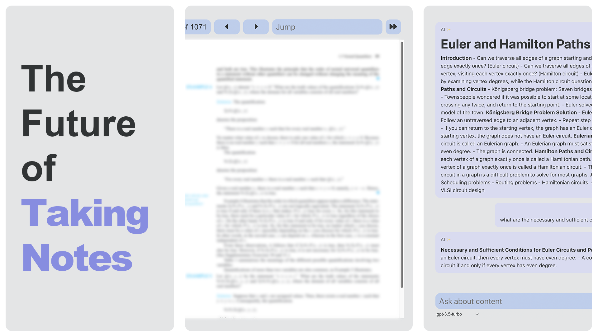
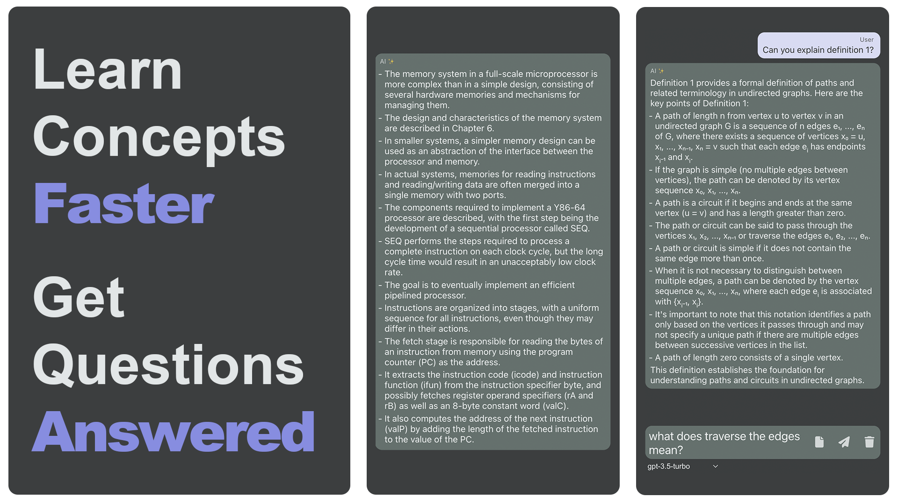

# AI PDF Summariser

## Website
<a href="https://mr2wei.github.io/AI-PDF-Summariser">mr2wei.github.io/AI-PDF-Summariser</a>

## Introduction
Using openAI API, this web app will be able to summarise and respond to questions about a given PDF file. Easily create notes from the textbook by letting the AI summarise and explain the content to you. If you're still confused, simply ask the AI questions regarding the text and it will answer using the information from the PDF.

## How to use
1. Upload a PDF file
2. Select Generate to summarise the text of the displayed page or simply type in the chat box to ask questions about the text.

Note: The file button cycles between using the active PDF page as context for your message ('-' symbol) or using multiple pages as context ('+' symbol) or no context ('x' symbol).

## Limitations
- It doesn't handle calculating math problems well since I haven't implemented any way for the AI to run equations.

## Current Progress
- Using function calling to allow the AI to get text from any page in the PDF.

## Issues
- Rendering latex is very finicky and doesn't always work.
